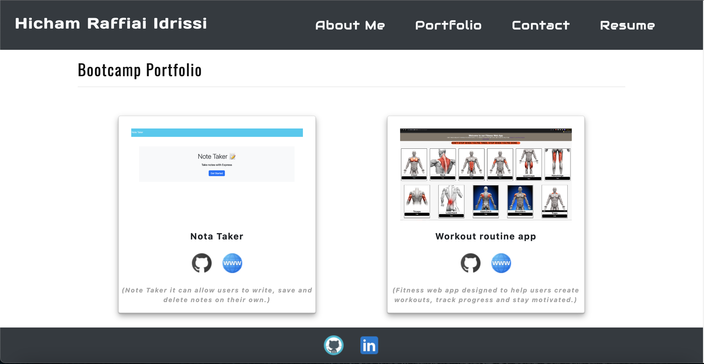
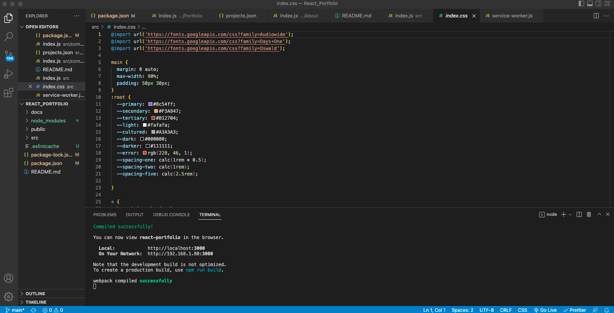

## React Portfolio
  

## Description
Being a web developer means being part of a community. You’ll need a place to share your projects not only if you're applying for jobs or working as a freelancer but also so that you can share your work with fellow developers and collaborate on future projects.

## Table of Contents

* [Installation](##Installation)
* [Usage](##Usage)
* [Screenshots](##Screenshots)

## Installation

Installation is a process of installing the dependencies required.
Intialize node package manager and then run the following commands;  
```script
npm install
```  
## Usage

 In order to use the application locallaly, Run the following command:  
```script
npm start
```  

#### Screenshot





  
